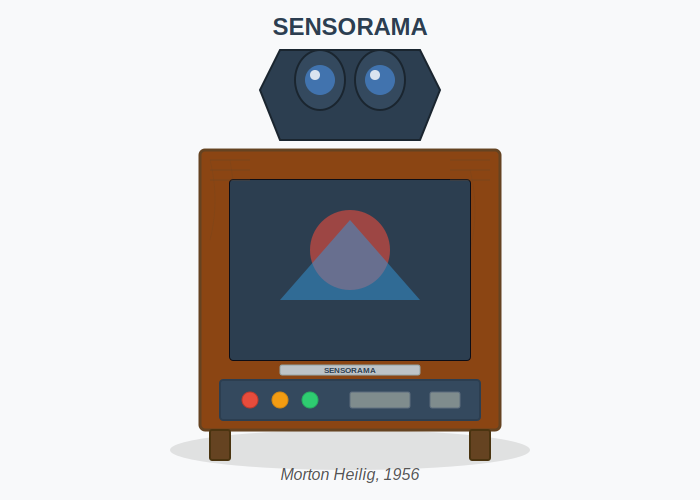

# Image Sourcing Guide for Historical VR Figures

## Current Status
The thesis currently uses professional SVG placeholders for all historical VR device figures. These are functional, responsive, and display correctly.

## Legal Image Sources for Replacement

### ✅ Figura 1: Sensorama (Morton Heilig, 1956)
**Best Sources:**
- USC HMH Foundation Moving Image Archive: https://hmharchive.com/project/morton-heilig-collection-finding-aid/
- Wikimedia Commons (search "Sensorama")
- Contact: USC archives for public domain or licensed images

### ✅ Figura 2: Link Trainer (1929)
**Best Sources:**
- Smithsonian National Air and Space Museum: https://airandspace.si.edu/multimedia-gallery/link-flight-simulator
- Wikimedia Commons (public domain US military photos)
- NARA (National Archives): Public domain historical aviation photos

### ✅ Figura 3: Sword of Damocles (Ivan Sutherland, 1968)
**Best Sources:**
- Computer History Museum: https://www.computerhistory.org/ ($25 licensing fee)
- ResearchGate academic papers (with attribution)
- Ivan Sutherland's 1968 paper (academic fair use)

### ✅ Figura 29: Child Using HMD
**Best Sources:**
- Modern stock photos (Pexels, Unsplash - free for commercial use)
- Search terms: "child VR headset", "kid virtual reality"
- Recommended: Pexels.com (free, no attribution required)

### ✅ Figura 30: HMD with Optical Sensors
**Best Sources:**
- Modern VR headset technical photos (HTC Vive, Oculus)
- Product press kits (usually allow editorial use)
- Technical documentation from manufacturers

### ✅ Figura 31: NASA HMD VIEW Project
**Best Sources:**
- NASA Image and Video Library: https://images.nasa.gov/ (PUBLIC DOMAIN)
- Smithsonian NASM: https://airandspace.si.edu/collection-objects/headset-virtual-reality-prototype/nasm_A19970613000
- Search NASA archives for: "VIEW project", "virtual reality", "1980s VR"

## How to Source Images Legally

### Step 1: Search NASA Archives (Public Domain)
```bash
# Go to https://images.nasa.gov/
# Search: "virtual reality" OR "VIEW project" OR "VR headset"
# Download full resolution JPG
# No attribution required (but recommended)
```

### Step 2: Wikimedia Commons (Public Domain/Creative Commons)
```bash
# Go to https://commons.wikimedia.org/
# Search each device name
# Check license: Look for "Public Domain" or "CC0"
# Download original file
# Follow attribution requirements if CC-BY
```

### Step 3: Pexels/Unsplash (Modern VR)
```bash
# For modern VR images (Figuras 29, 30)
# Pexels.com - completely free, no attribution
# Unsplash.com - free with optional attribution
# Search: "VR headset child", "virtual reality sensors"
```

### Step 4: Museum Archives (Licensed)
```bash
# Computer History Museum: $25 per image
# Contact museums directly for academic use
# Often grant free use for educational purposes
```

## Recommended Image Specifications

- **Format**: JPG (for photographs)
- **Resolution**: 1200-1600px width (web optimized)
- **File size**: Under 500KB per image
- **Quality**: High enough to show details, but web-optimized
- **Aspect ratio**: Original (don't distort historical photos)

## Integration Process

Once you have the images:

1. **Save to images folder** with descriptive names:
   - `sensorama-heilig-1956.jpg`
   - `link-trainer-1929.jpg`
   - `sword-of-damocles-1968.jpg`
   - `nasa-view-hmd.jpg`
   - `child-using-vr-headset.jpg`
   - `hmd-with-sensors.jpg`

2. **Update HTML files** - Replace current SVG references:
```html
<!-- OLD -->


<!-- NEW -->

```

3. **Verify build** runs successfully:
```bash
npm run build
```

## Why We Can't Auto-Download

**Legal Reasons:**
- Most historical photos are copyrighted
- Automated scraping violates terms of service
- Academic fair use requires manual verification

**Technical Reasons:**
- Hotlinking external images is unreliable
- Images should be hosted locally
- Build process requires local files

## Current Recommendation

**Keep the SVG placeholders** until you can source legal images:
- ✅ Professional appearance
- ✅ Consistent design
- ✅ Fully functional
- ✅ No copyright issues
- ✅ Small file sizes
- ✅ Resolution independent

**When ready to replace:**
1. Source images from recommended locations above
2. Place in `/images/` folder
3. I'll update all HTML references
4. Rebuild and verify

---

**Status**: Documentation complete
**Next Steps**: User to source legal images, then integration can proceed
